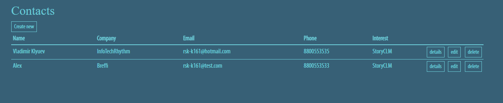
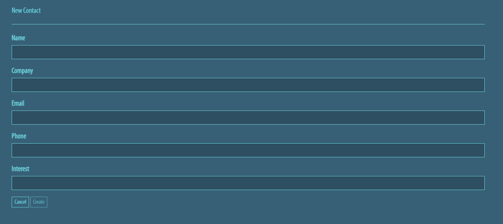
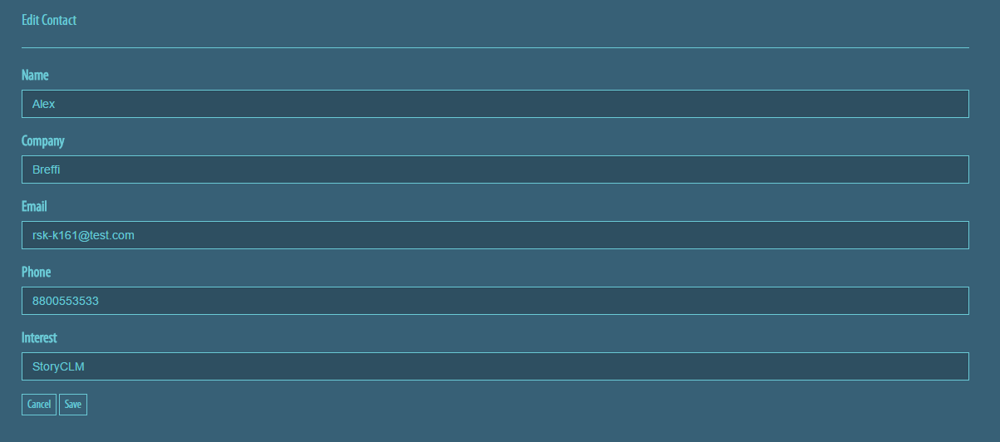
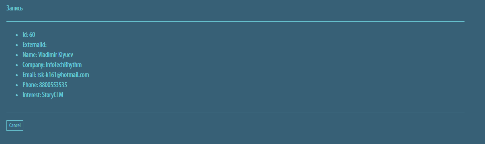

# Senior Python Developer (MedTech)

Данное приложение является тестовым заданием на позицию Senior разработчика в команду приложения "Незабудка".

## Требования
Напишите и разверните веб-приложение на языке `Python`, используя фреймворк `Django` и любую СУБД. Приложение - это простой сервис, накапливающий информацию о клиентах.

Оно должно состоять из нескольких разделов:
- таблица с контактами
- форма создания нового контакта
- форма редактирования контакта
- форма удаления контакта
- форма просмотра контакта

## Основная функциональность

**Форма с контактами**

Стартовый экран приложения. На нем отображаются все контакты из базы данных (БД).

Форма должна содержать постраничную навигацию и поиск на серверной стороне. 1 страница = max 10 записей. При этом, количество страниц зависит от количества записей в БД и от результатов поиска. Поиск должен фильтровать количество записей в таблице и количество страниц.

**Форма создания нового контакта**

Сохраняет новый контакт в БД. Необходимо реализовать валидацию полей `Email` и `Phone` на клиентской и серверной стороне.

**Форма редактирования контакта**

Эта форма позволяет редактировать и сохранить контакт из БД. Необходимо реализовать валидацию полей `Email` и `Phone` на клиентской и серверной стороне.

**Форма удаления контакта**

Удаление контакта из БД.

**Форма просмотра контакта**

Содержит детальную информацию о контакте, включая идентификатор записи и внешний ключ.

## Дополнительная функциональность

**Экспорт и импорт**

Сделайте возможность загружать и выгружать контакты в БД, используя форматы: `json` или `csv`.

> Сделать на главном экране кнопку `Экспорт`. При нажатии на кнопку (ссылку) отправляется запрос на сервер, данные выбираются из БД, преобразуются в нужный формат и возвращаются на клиент. Ответ должен восприниматься как файл и браузер начинал скачивание.

> Сделать на главном экране кнопку `Импорт`. При нажатии на кнопку (ссылку) открывается новая форма с возможностью выбора файла. Окно выбора файла фильтрует все файлы, кроме указанных выше. После отправки файла на сервер, нужно сверить содержимое файла с ожидаемым форматом и затем  распарсить его.Каждую запись необходимо провалидировать перед загрузкой в БД.

**Парсинг**

Необходимо распарсить страницу http://breffi.ru/ru/about, выделить 5 базовых ценностей компании и отобразить их на главной форме, над таблицей.

**Внешний сервис**

Реализуйте загрузку контактов, используя данные из внешнего сервиса https://jsonplaceholder.typicode.com/users

**REST API**

Сделайте REST API для управления контактами (CRUD).

**Иерархическая структура**

Необходимо расширить структуру данных и добавить объект Компания. Каждый контакт должен быть связан с компанией: при создании нового контакта необходимо выбирать из списка существующих компани, либо заводить новую. У каждой компании должен быть адрес. Адреса необходмо хранить в иерархической структуре: Страна-Область-Город-Улица-Дом-Офис. Дом и офис могут быть пустые. 

Заполните таблицы тестовыми данными. При этом должны присутствовать компании как с полными данными об адресе (вплоть до номера офиса) так и с частичными разного уровня (город, улица, дом).

Выведите список компаний с адресами. Адрес должен содержать максимальное количество известной информации, начиная с названия страны. 

Пример: Браться и Ко - РФ, Ставропольский край, г. Буденновск, ул. Ленина, д.5, офис 6 (известен полный адрес) Рога и копыта - Рф, Омская область, г. Омск (известен только город) Быки и коровы - Рф, Омская область, г. Омск, ул. Менделеева (известна только улица)

Сделайте поиск по адресу на вхождение строки. Для найденных адресов выведете компании, которые достоверно расположенны внутри территории адреса. Например, для примера выше для г. Омск будет выдано 2 компании ("Рога и копыта" и "Быки и коровы"). 

Для ул. Менделеева в г. Омске будет возвращена компания "Быки и коровы". Можно еще одно задание: вернуть компании которые не исключено, что находятся по данному адресу, например, т.к. для Рога и копыта не известна улица, то не исключено что они находятся на улице Менделеева. Уже попахивает олимпиадой)
